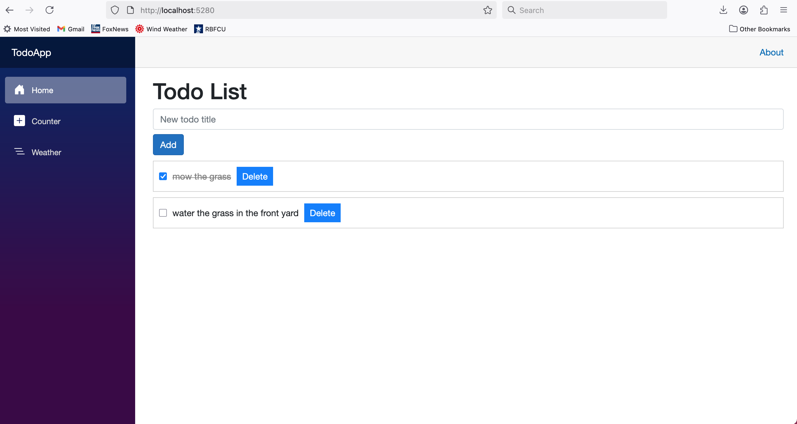

# Blazor Todo App - .NET 8 CRUD Demo

  
*(Placeholder: Add a screenshot of the running app showing the todo list with items added/toggled/deleted.)*

## Overview
This is a simple, full-stack CRUD (Create, Read, Update, Delete) application built with **Blazor Server** in .NET 8. It demonstrates asynchronous data operations using **Entity Framework Core** with **SQLite** as the database. Users can add todos, mark them as complete, and delete them—data persists across sessions.

Key Features:
- Interactive form for adding new todos.
- Real-time list with checkboxes for completion status.
- Delete functionality.
- Server-side rendering for seamless UI updates via `StateHasChanged()`.

This project was developed as a quick demo to showcase modern .NET web development skills, including async EF queries and Blazor component lifecycle management. It's cross-platform and runs on macOS, Windows, or Linux.

## Tech Stack
- **Backend**: .NET 8, C#, Entity Framework Core 8.0
- **Database**: SQLite (lightweight, embedded—no server setup)
- **Frontend**: Blazor Server (Razor components)
- **IDE**: Visual Studio Code (with C# extension)
- **Tools**: .NET CLI for scaffolding and migrations

## Prerequisites
- [.NET 8 SDK](https://dotnet.microsoft.com/download/dotnet/8.0) (verified on macOS 11.7.10 Big Sur)
- [Visual Studio Code](https://code.visualstudio.com/) with the [C# extension](https://marketplace.visualstudio.com/items?itemName=ms-dotnettools.csharp)
- Terminal/Command Prompt
- Git (for version control)

## Setup
1. **Clone the Repository**:
   ```bash
   git clone https://github.com/bmalchemy/BlazorTodoApp.git
   cd BlazorTodoApp/TodoApp
   ```

2. **Restore Dependencies**:
   ```bash
   dotnet restore
   ```

3. **Install EF Core Tools** (one-time, if not global):
   ```bash
   dotnet tool install --global dotnet-ef --version 8.0.0
   ```

4. **Apply Database Migrations**:
   ```bash
   dotnet ef database update
   ```
   - This creates the `todos.db` file in the project root.

## Running the App
```bash
dotnet build
dotnet run
```
- Open [https://localhost:5xxx](https://localhost:5001) (port shown in console).
- Add a todo via the form, toggle checkboxes, or delete items—the UI updates in real-time.

To stop: Press `Ctrl+C` in the terminal.

## Project Structure
```
TodoApp/
├── Data/                 # EF DbContext (AppDbContext.cs)
├── Models/               # Data models (TodoItem.cs)
├── Components/Pages/     # Razor components (Home.razor with CRUD logic)
├── wwwroot/css/          # Styles (app.css)
├── Program.cs            # Service registration (DbContext, Blazor services)
├── appsettings.json      # Connection string
├── TodoApp.csproj        # Project file with NuGet packages
└── todos.db              # SQLite DB (generated)
```

## Usage Example
1. Enter a title (e.g., "Buy groceries") and click **Add**.
2. Check the box to mark complete—strikes through the text.
3. Click **Delete** to remove.
4. Refresh the page: Data persists!

## Potential Enhancements
- Add Edit functionality (populate form on item click).
- Validation with DataAnnotations (e.g., `[Required]` on Title).
- Authentication (e.g., via Identity).
- Deploy to Azure (swap SQLite for SQL Server).

## Notes
- Built on macOS with VS Code—tested for compatibility.
- For production, replace SQLite with a robust DB like PostgreSQL and add error handling.
- Debug logs (Console.WriteLine) are included in code for troubleshooting; remove for release.

## License
MIT License—feel free to fork and adapt!

---

*Built for the Airrosti Software Engineer interview demo. Questions? Reach out!*
